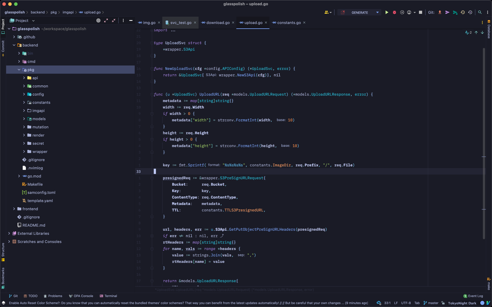
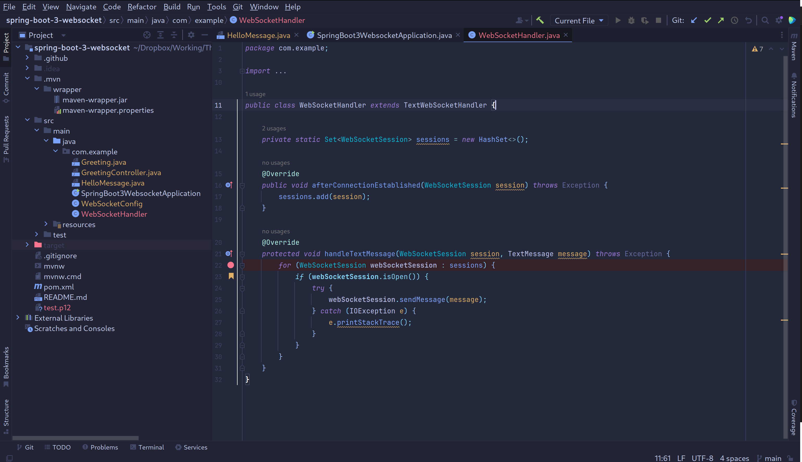
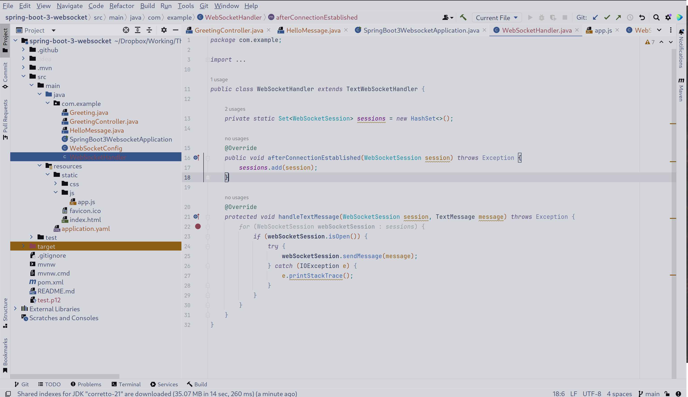

# 🏙 Tokyo Night

<!-- Plugin description -->
> I forked from the repository [tokyonight-jetbrains](https://github.com/alexadhy/tokyonight-jetbrains) and continued to maintain it.

There are 4 variants here:

- TokyoNight Storm

    

- TokyoNight Night 

    

- TokyoNight Moon

    

- TokyoNight Day 

    

<!-- Plugin description end -->